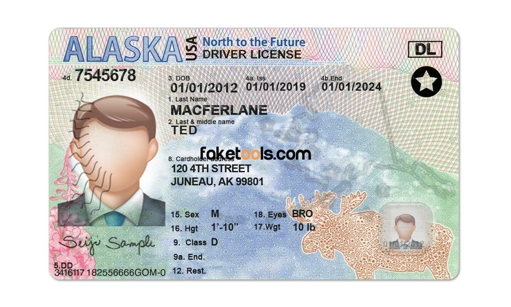
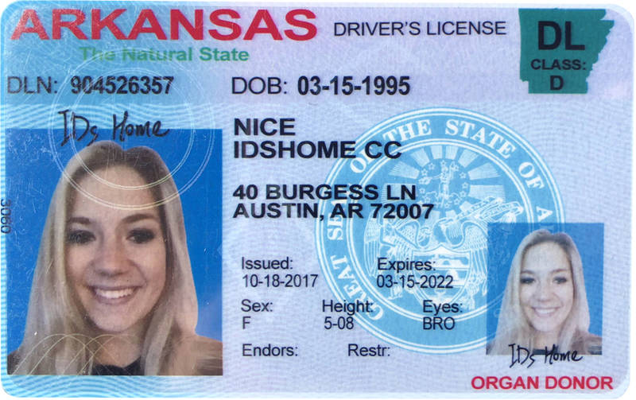

# Telegram Bot для создания водительского удостоверения США (Аляска, Арканзас)

## Инструкция по запуску

### 1. ```В переменное окружения в Dockerfile нужно проставить API токен бота```
### 2. ```docker-compose up --build```

## Пример карт:
### 
### 